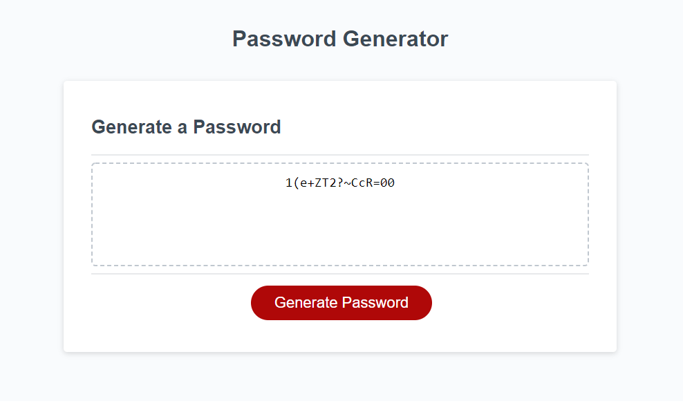

# Password-Generator
# can generate password based on users' choice of length, number, uppercase, lower case and symbol
# will also check the input if valid
# see link to the application
# https://canon70d.github.io/Password-Generator/
# attached a overview of the Generator
# 

# commit - 1, can generate password with all 4 characters, but can't chose specific character type to make combo
# commit - 2, users can chose what they want, but some combo not working ... 
# commit - 3, had to achieve the requirement in a bad way ......